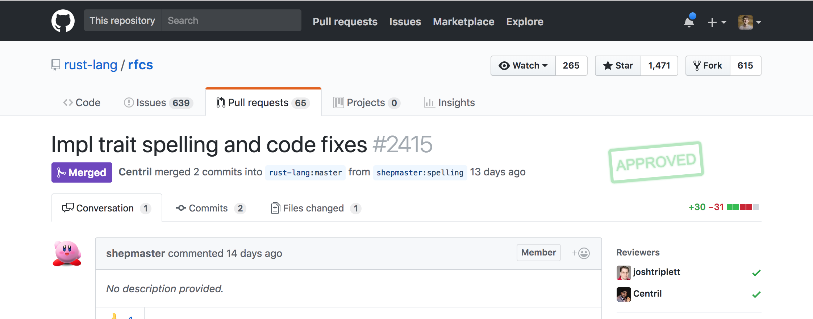

# LGTM = Looks Good to Me

A Chrome extension to print review statuses as stamp labels on the GitHub pull request overview page.

The extention adds stamps automatically using information already available on the page. It does not replace any functionality provided by GitHub, but makes review statuses more visible.

## History

The project is inspired by [a tweet](https://twitter.com/d_jones/status/992146407128686592) and the first version has been implemented over a weekend.

## How to contribute

Feel free to open an issue if you found a bug or have an idea, but it is much more appreciated if you open a PR instead.

## Copyrights

(c) 2018, Alexander Sulim, https://sul.im
